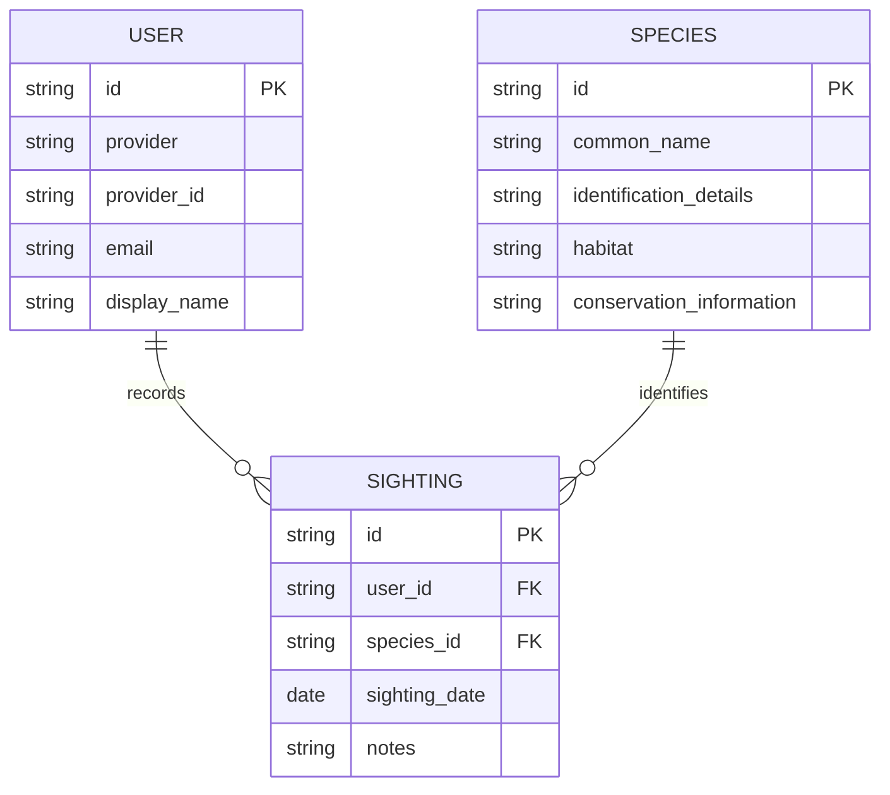

```mermaid
erDiagram
    USER ||--o{ SIGHTING : records
    SPECIES ||--o{ SIGHTING : identifies

    USER {
        string id PK
        string provider
        string provider_id
        string email
        string display_name
    }

    SPECIES {
        string id PK
        string common_name
        string identification_details
        string habitat
        string conservation_information
    }

    SIGHTING {
        string id PK
        string user_id FK
        string species_id FK
        date sighting_date
        string notes
    }
```
